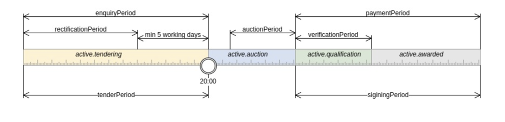

Overview
========

This ``openprocurement.auctions.lease`` package documentation contains information for Participants
of the PROZORRO.SALE system and intended to discover all aspects of ``lease procedure``.

The following subjects can act as an Organizer:

* `State Property Fund of Ukraine`_;

* state enterprises;

* authorities, which are authorized by the Verkhovna Rada of the Autonomous Republic of Crimea;

* enterprises, institutions and organizations.

In order to perform state property lease specialized procedure is available:
 
 * ``propertyLease`` - lease of the state property.

Glossary
--------

Tender Procedure
    a process which includes:

    * lease tender procedure initialization by an Organizer;

    * initial bids proposals by Participants (Bidders);

    * auction (3 rounds);

    * qualification (awarding) - identifying of the winner;

    * payment;

    * contract signing;

Organizer
    lease procedure initiator

Minimum number of qualified bids [``minNumberOfQualifiedBids``]
    minimum desired participants' count to consider procedure successful

Invalidation date [``invalidationDate``]
    date when the last editing was made by an Organizer (initial bids invalidation occurs)

Valid bid
    a bid which value is equal or greater then a value of ``value.amount + minimalStep``

CAV-PS
    the main classifier

CPVS (Common Procurement Vocabulary)
    additional (secondary) classifier

Tender Procedure life cycle
    consists of the following periods:

    * ``tenderPeriod`` - the time period during which tender ``bids`` are accepting;

    * ``enquiryPeriod`` - the time period during which participants can ask ``questions`` to clarify tender's terms;

    * ``rectificationPeriod`` - the time period during which an Organizer can perform changes to tender terms;

    * ``auctionPeriod`` - the time period of ``auction`` itself;

    * ``verificationPeriod`` - the time period during which an Organizer identifies a winner;

    * ``paymentPeriod`` - the time period during which Participant (Winner) performs payment;

    * ``signingPeriod`` - the time period of downloading and activating of Contract by an Organizer;

.. note::

    * ``tenderPeriod`` has to be at least 5 days longer than ``rectificationPeriod``;
    * as a result of verification process is auction ``Protocol`` (confirmed and downloaded by an Organizer);
    * every period has its ``startDate`` and ``endDate``.

Features
--------

* The only currency (``value.currency``) for this procedure is hryvnia (UAH).

* The only date Organizer has to provide is ``Auction.auctionPeriod.startDate`` - approximate Auction start date - actual value of Auction start will be calculated based on current system load. The rest will be calculated automatically.

* ``tenderPeriod`` duration must be at least 7 calendar days.

* Procedure can be switched from ``draft`` status to ``active.tendering``.

* During ``active.tendering`` period participants can ask questions, submit proposals, and upload documents.

* The items within an auction are allowed to be from different CAV groups.

There is predefined list of possible items to lease (please, refer to ``CAV-PS`` classification schema):

    * 04000000-8
    * 05000000-5
    * 06000000-2
    * 30000000-9
    * 31000000-6
    * 32000000-3
    * 33000000-0
    * 34000000-7
    * 35000000-4
    * 37000000-8
    * 38000000-5
    * 39000000-2
    * 42000000-6
    * 43000000-3

* Additional classification (CPVS) is constant for ``propertyLease`` procedure - ``PA01-7``.

* The minimum desired participants' count by default is 2, but there is option to decrease it explicitly to 1 participant;

* Optionally an Organizer can set ``tenderPeriod.endDate`` - if so, auction can't start earlier 3 days after.

* Optionally an Organizer can set ``enquiryPeriod.endDate``, if not provided - it will be calculated automatically.

* An Organizer can edit procedure only during ``rectificationPeriod`` (increase and decrease ``value.amount``, ``guarantee.amount``, ``minimalStep.amount``).

* Organizer can add and edit documents only during ``rectificationPeriod``.

* As soon as the action is edited, the status of all of the submitted bids will be switched to ``invalid``.

* There is obligatory participant qualification via guarantee payment.

* The only criterion for choosing a winner is the price, provided the tenderer complies with the qualifying criteria determined by the Organizer.

Conventions
-----------

API accepts `JSON`_ or form-encoded content in
requests.  It returns JSON content in all of its responses, including
errors.  Only the UTF-8 character encoding is supported for both requests
and responses.

All API POST and PUT requests expect a top-level object with a single
element in it named ``data``.  Successful responses will mirror this format.
The data element should itself be an object, containing the parameters for
the request.  In the case of creating a new auction, these are the fields we
want to set on the auction itself.

If the request was successful, we will get a response code of ``201``
indicating the object was created.  That response will have a data field at
its top level, which will contain complete information on the new auction,
including its ID.

If something went wrong during the request, we'll get a different status
code and the JSON returned will have an ``errors`` field at the top level
containing a list of problems.  We look at the first one and print out its
message.

Project status
--------------

The project currently is in beta status.

The source repository for this project is on GitHub:
https://github.com/prozorro-sale/openprocurement.auctions.lease

You can leave feedback by raising a new issue on the `Issue tracker
<https://github.com/prozorro-sale/openprocurement.auctions.lease/issues>`_ (GitHub
registration necessary).  

Documentation of related packages
---------------------------------

* `OpenProcurement API <http://api-docs.openprocurement.org/en/latest/>`_

Change log
----------

0.1.0

Released: not released

Next steps
----------

TBD: provide an API tutorial

.. You might find it helpful to look at the :ref:`tutorial`.

**********
References
**********

.. target-notes::

.. _`State Property Fund of Ukraine`: http://www.spfu.gov.ua
.. _`JSON`: http://json.org/
